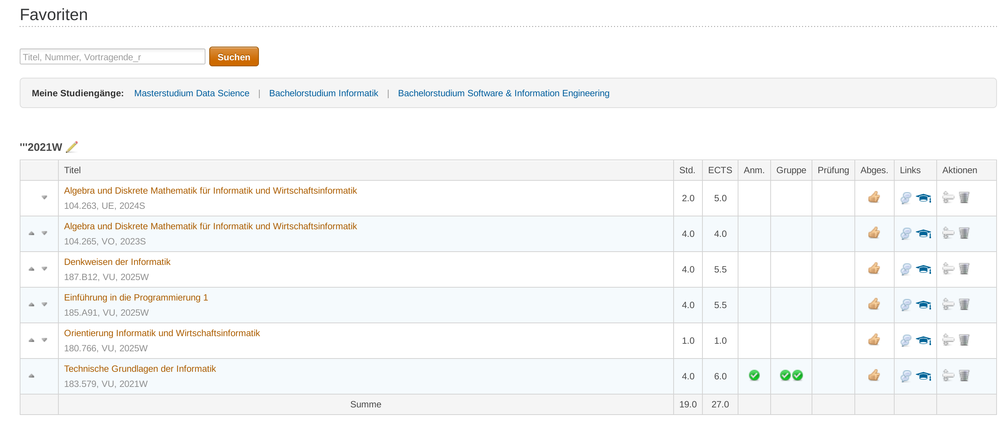

# TISS QoL Upgrades

A Tampermonkey userscript that enhances your TU Wien TISS and TUWEL experience with quality-of-life improvements,
automatic login features, and visual course tracking.

## ✨ Features

- **Quick Study Program Access** - Direct links to your study programs on the favorites page for easy navigation
- **Completed Course Highlighting** - Visual indicators for completed courses in curriculum view
- **Automatic Login** - Automatically clicks useless buttons that just display a message
- **Auto-Skip Safety Notes** - Automatically bypasses password warning dialogs

## 📸 Screenshots

### Study Program Links

Quick access links to your Curricula appear below the search bar on your favorites page:



### Completed Course Highlighting

Completed courses are highlighted in green for easy tracking:


### Current Curricula highlighting

Highlights the current curricula in the "Studienangebot".


### Automatic Login

Seamlessly skip through login prompts. It automatically skips every screen of the login process. Except where you are
inputting your credentials

## 🚀 Installation

1. **Install Tampermonkey**
    - [Chrome](https://chrome.google.com/webstore/detail/tampermonkey/dhdgffkkebhmkfjojejmpbldmpobfkfo)
    - [Firefox](https://addons.mozilla.org/en-US/firefox/addon/tampermonkey/)
    - [Edge](https://microsoftedge.microsoft.com/addons/detail/tampermonkey/iikmkjmpaadaobahmlepeloendndfphd)

2. **Install the Script**
    - Click [here](./TissQolUpgrades.user.js) to install
    - Or copy the script content and create a new script in Tampermonkey

3. **Configure Your Settings** (see below)

4. **Refresh TISS** and enjoy!

## ⚙️ Configuration

Open the script in Tampermonkey and customize the settings at the top:

### Basic Settings

**Current Semester** - Set this to your active semester (e.g., "2025S" for Summer 2025, "2025W" for Winter 2025). This
affects all semester-based links and highlighting.

```javascript
const currentSemester = "2022W";
```

**Automatic Login** - Enable/disable automatic login flow. Set to `false` if you want to manually log in.

```javascript
const automaticLogin = true;
```

### Study Programs

```javascript
const currentStudium = new Map([
    ["Bachelorstudium Software & Information Engineering", "https://tiss.tuwien.ac.at/..."],
    ["Bachelorstudium Informatik", "https://tiss.tuwien.ac.at/..."],
    ["Masterstudium Data Science", "https://tiss.tuwien.ac.at/..."]
]);
```

**Your Study Programs** - Add your enrolled study programs with their curriculum URLs:

- Key: Display name of the study program
- Value: TISS curriculum URL (find this by navigating to your study program in TISS and copying the URL)

### Study Program Highlighting

```javascript
const highlightCurrentStudium = true;
```

**Highlight Current Programs** - When viewing the study codes page, your configured study programs will be highlighted
in light green.

### Completed Courses

```javascript
const completedLVANames = [
    "Einführung in die Programmierung 1",
    "Algorithmen und Datenstrukturen",
    // ... add your completed courses
];
```

**Completed Courses List** - Add the exact names of courses you've completed. These will be:

- Highlighted in light green in the curriculum view
- Used to track your study progress visually

**Tip:** Copy course names directly from TISS to ensure exact matching.

## 🎯 Usage

Once installed and configured, the script automatically activates on TISS and TUWEL pages:

### On Favorites Page (`/education/favorites`)

- Study program links appear below the search bar
- Click any link to jump directly to that program's current semester curriculum


### On Curriculum Page (`/curriculum/curriculumSemester`)

- Completed courses are highlighted in green
- Courses from other semesters are shown in red
- Easily track which courses you've finished


### On Login Pages

- Automatically navigates through login flow
- Skips password warning dialogs
- Presses Enter on login forms
- No manual interaction needed

## 🔧 Customization Tips

### Finding Your Study Program URLs

1. Go to TISS → Studies → Your Study Program
2. Navigate to the curriculum page
3. Copy the URL from your browser
4. Paste it into the `currentStudium` Map

### Adding Completed Courses

1. Go to your curriculum page in TISS
2. Copy the exact course title (without the course number)
3. Add it to the `completedLVANames` array
4. Refresh the page to see the highlighting

### Updating the Current Semester

At the start of each semester:

1. Update `currentSemester` to the new semester code
2. All links will automatically update
3. Semester highlighting will reflect the new active semester

## 📝 Notes

- Course names must match exactly (case-sensitive) for highlighting to work
- The script only runs on `tiss.tuwien.ac.at` and `tuwel.tuwien.ac.at` domains
- Automatic login requires your credentials to be saved in your browser
- Links are dynamically generated based on your current semester setting

## 🐛 Troubleshooting

**Links not appearing?**

- Make sure you're on the favorites page
- Check that study program URLs are correctly formatted
- Open browser console (F12) to check for errors

**Courses not highlighting?**

- Verify course names match exactly (copy from TISS)
- Check that you're viewing the curriculum semester page
- Try refreshing the page after making changes

**Automatic login not working?**

- Ensure `automaticLogin` is set to `true`
- Check that your credentials are saved in the browser
- Some login steps require a few seconds to load

## 📄 License

MIT License - Feel free to modify and share!

## 🤝 Contributing

Found a bug or have a feature request? Feel free to open an issue or submit a pull request!

---

Made with ❤️ for TU Wien students